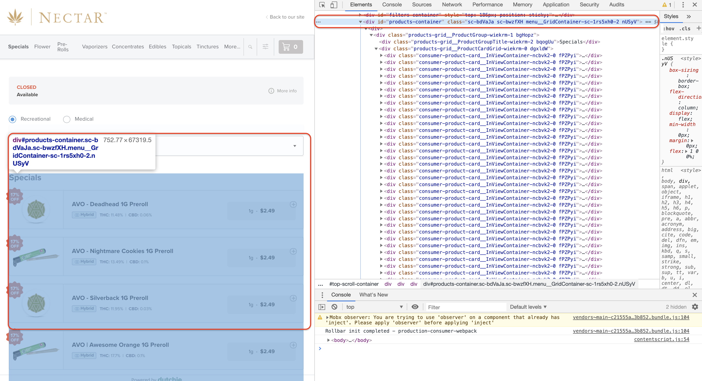
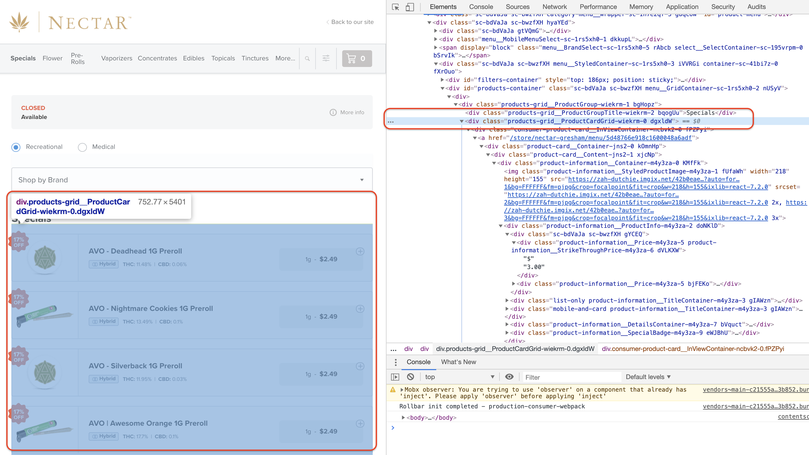
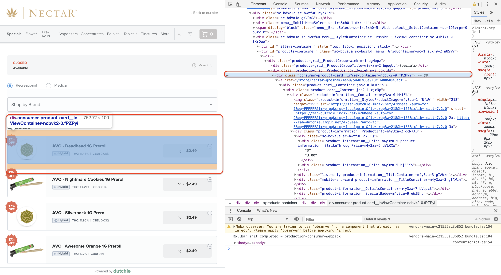

Scrape & Download - Cannabis Retail Data
================
Martin Frigaard
current version: 2019-11-27

## Cannabis web data

Resources:

  - [Web Scraping Product Data in R with rvest and
    purrr](https://www.business-science.io/code-tools/2019/10/07/rvest-web-scraping.html)

  - <https://www.datacamp.com/community/tutorials/r-web-scraping-rvest>

  - <https://blog.rstudio.com/2014/11/24/rvest-easy-web-scraping-with-r/>

  - <https://tutorials.datasciencedojo.com/r-tutorial-web-scraping-rvest/>

This document covers how to scrape the `dutchie` website using R.

## The website

Scrape this website: [dutchie: Order Marijuana Online for Delivery or
Pickup](https://dutchie.com/store/nectar-gresham/menu?)

### 1\) Check `robots.txt`

Could not find this–\> moved on.

### 2\) Packages

``` r
# Load libraries
library(rvest)     # HTML Hacking & Web Scraping
library(jsonlite)  # JSON manipulation
library(tidyverse) # Data Manipulation
library(tidyquant) # ggplot2 theme
library(xopen)     # Opens URL in Browser
library(knitr)     # Pretty HTML Tables
```

### 3\) Store URL for all items

This is the URL for all the items in the Gresham store:

`https://dutchie.com/store/nectar-gresham/menu?show=All`

Store this in `dutchie_url`

``` r
# URL to View All Products
dutchie_url <- "https://dutchie.com/store/nectar-gresham/menu?show=All"
# This will open the `dutchie_url`
# View URL in Browser
# xopen(dutchie_url)
```

### 4\) Read HTML

``` r
# Read HTML from URL 
dutchie_html <- xml2::read_html(x = dutchie_url)
dutchie_html %>% str()
```

    #>  List of 2
    #>   $ node:<externalptr> 
    #>   $ doc :<externalptr> 
    #>   - attr(*, "class")= chr [1:2] "xml_document" "xml_node"

Ok this looks just like the example.

### 5\) Get the Raw Data

The Chrome DevTools shows the following:

<!-- -->

## Products container

Here is the `products-container`:

``` html
<div id="products-container" class="sc-bdVaJa sc-bwzfXH menu__GridContainer-sc-1rs5xh0-2 nUSyV">
<div>
<div class="products-grid__ProductGroup-wiekrm-1 bgHopz">
<div class="products-grid__ProductGroupTitle-wiekrm-2 bqogUu"> 
Specials</div>
<div class="products-grid__ProductCardGrid-wiekrm-0 dgxldW">
<div class="consumer-product-card__InViewContainer-ncbvk2-0 fPZPyi">
<a href="/store/nectar-gresham/menu/5d48766e918c1600048a6adf">
<div class="product-card__Container-jns2-0 kOmnHp">
<div class="product-card__Content-jns2-1 xjcNp">
<div class="product-information__Container-m4y3za-0 KMfFk">
```

Below I try to get the `html_nodes()` from the `div class=` or `id`.

``` r
dutchie_html %>% 
    rvest::html_nodes(".products-container")
```

    #>  {xml_nodeset (0)}

``` r
dutchie_html %>%
    rvest::html_nodes(".products-grid__ProductGroup-wiekrm-1 bgHopz")
```

    #>  {xml_nodeset (0)}

``` r
dutchie_html %>%
    rvest::html_nodes(".products-grid__ProductGroupTitle-wiekrm-2 bqogUu")
```

    #>  {xml_nodeset (0)}

Try the Product Card Grid.

<!-- -->

``` r
dutchie_html %>%
    rvest::html_nodes(".products-grid__ProductCardGrid-wiekrm-0 dgxldW")
```

    #>  {xml_nodeset (0)}

And finally we check the Inview Container.

<!-- -->

Next we try the following `class` ids.

``` r
dutchie_html %>%
    rvest::html_nodes(".consumer-product-card__InViewContainer-ncbvk2-0 fPZPyi")
```

    #>  {xml_nodeset (0)}

``` r
dutchie_html %>%
    rvest::html_nodes(".product-card__Container-jns2-0 kOmnHp")
```

    #>  {xml_nodeset (0)}

``` r
dutchie_html %>%
    rvest::html_nodes(".product-card__Content-jns2-1 xjcNp")
```

    #>  {xml_nodeset (0)}

``` r
dutchie_html %>%
    rvest::html_nodes("product-information__Container-m4y3za-0 KMfFk")
```

    #>  {xml_nodeset (0)}

No luck so far.
